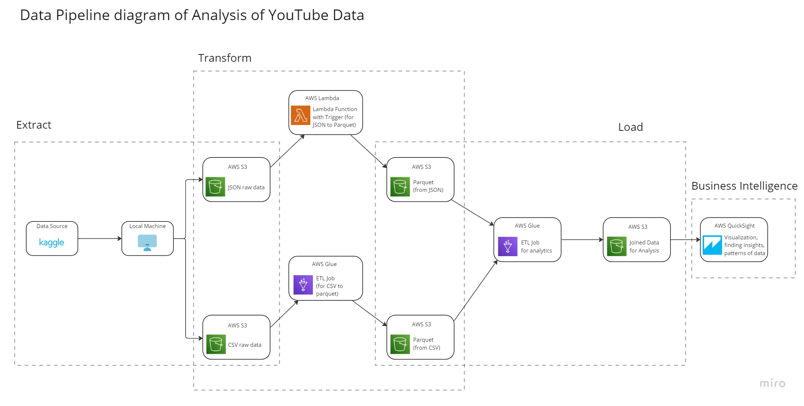

# AWS Data Engineering Project - YouTube Data Analysis

The goal of this project is to help our imaginary customer in her marketing campaign by providing her a data ready for finding out top category of YouTube videos to successfully market her product.  

Dataset : [link](https://www.kaggle.com/datasets/datasnaek/youtube-new)

### AWS services used:

* Extraction:
    * CLI
    * S3
    * IAM
* Transformation:
    * S3 
    * Lambda
        * Trigger
    * Glue
        * Crawler
        * Database
        * ETL Job
    * Athena
    * IAM
* Loading
    * S3
    * Glue
        * Database
        * ETL Job
    * IAM
* Business Intelligence
    * S3
    * Glue
        * Database
    * QuickSight
    * IAM

### File Formats Handled:
* CSV
* JSON
* Parquet

### References

* https://www.youtube.com/watch?v=yZKJFKu49Dk
* https://aws.amazon.com/?nc2=h_lg